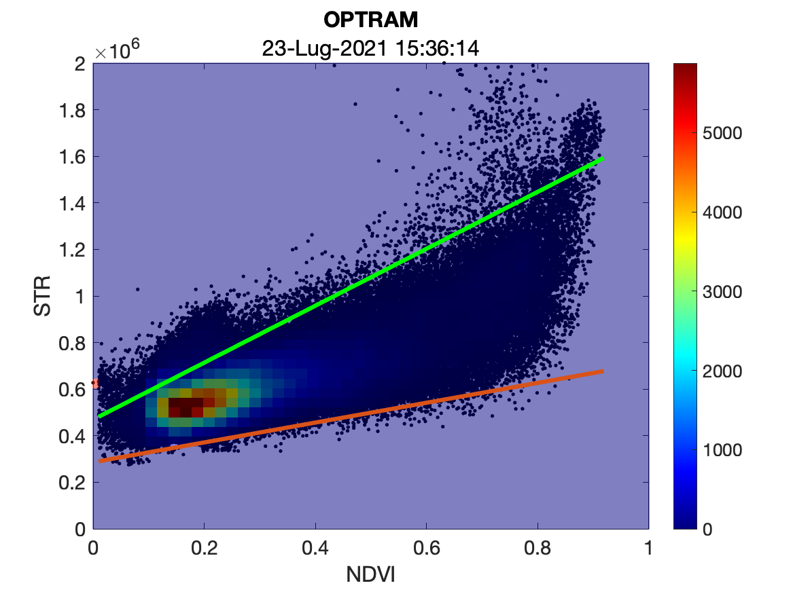
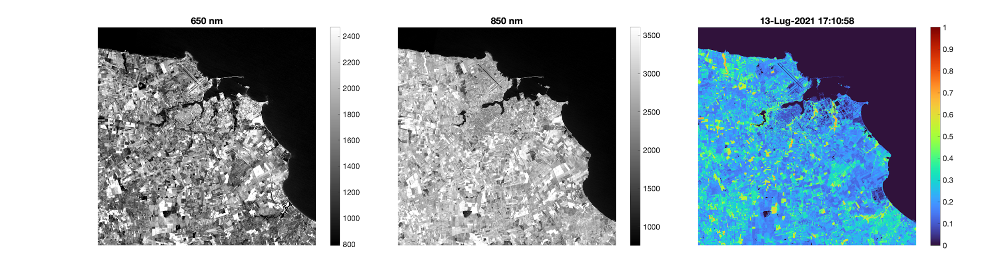
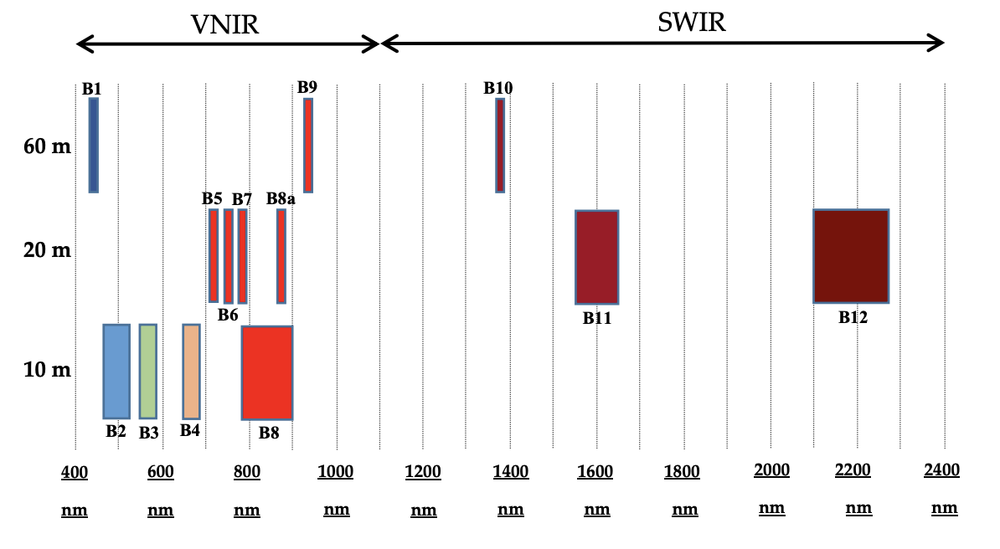
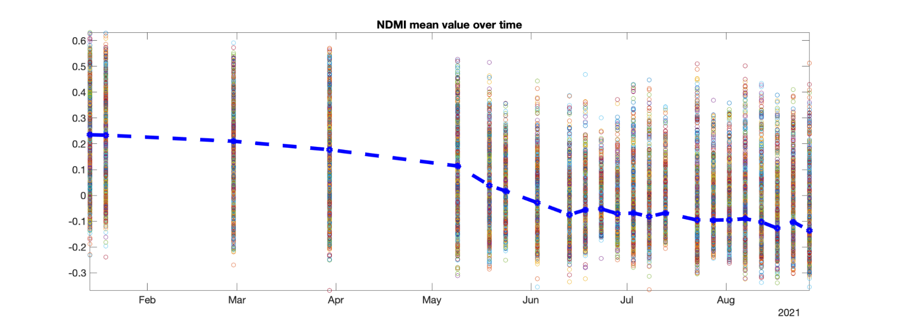

<!-----
NEW: Check the "Suppress top comment" option to remove this info from the output.

Conversion time: 20.014 seconds.


Using this Markdown file:

1. Paste this output into your source file.
2. See the notes and action items below regarding this conversion run.
3. Check the rendered output (headings, lists, code blocks, tables) for proper
   formatting and use a linkchecker before you publish this page.

Conversion notes:

* Docs to Markdown version 1.0β31
* Mon Dec 27 2021 06:26:54 GMT-0800 (PST)
* Source doc: Copia di Danilo Danese IPAV relazione project v1.1
* Tables are currently converted to HTML tables.
* This document has images: check for >>>>>  gd2md-html alert:  inline image link in generated source and store images to your server. NOTE: Images in exported zip file from Google Docs may not appear in  the same order as they do in your doc. Please check the images!


WARNING:
You have 38 H1 headings. You may want to use the "H1 -> H2" option to demote all headings by one level.

----->


<p style="color: red; font-weight: bold">>>>>>  gd2md-html alert:  ERRORs: 0; WARNINGs: 1; ALERTS: 58.</p>
<ul style="color: red; font-weight: bold"><li>See top comment block for details on ERRORs and WARNINGs. <li>In the converted Markdown or HTML, search for inline alerts that start with >>>>>  gd2md-html alert:  for specific instances that need correction.</ul>

<p style="color: red; font-weight: bold">Links to alert messages:</p><a href="#gdcalert1">alert1</a>
<a href="#gdcalert2">alert2</a>
<a href="#gdcalert3">alert3</a>
<a href="#gdcalert4">alert4</a>
<a href="#gdcalert5">alert5</a>
<a href="#gdcalert6">alert6</a>
<a href="#gdcalert7">alert7</a>
<a href="#gdcalert8">alert8</a>
<a href="#gdcalert9">alert9</a>
<a href="#gdcalert10">alert10</a>
<a href="#gdcalert11">alert11</a>
<a href="#gdcalert12">alert12</a>
<a href="#gdcalert13">alert13</a>
<a href="#gdcalert14">alert14</a>
<a href="#gdcalert15">alert15</a>
<a href="#gdcalert16">alert16</a>
<a href="#gdcalert17">alert17</a>
<a href="#gdcalert18">alert18</a>
<a href="#gdcalert19">alert19</a>
<a href="#gdcalert20">alert20</a>
<a href="#gdcalert21">alert21</a>
<a href="#gdcalert22">alert22</a>
<a href="#gdcalert23">alert23</a>
<a href="#gdcalert24">alert24</a>
<a href="#gdcalert25">alert25</a>
<a href="#gdcalert26">alert26</a>
<a href="#gdcalert27">alert27</a>
<a href="#gdcalert28">alert28</a>
<a href="#gdcalert29">alert29</a>
<a href="#gdcalert30">alert30</a>
<a href="#gdcalert31">alert31</a>
<a href="#gdcalert32">alert32</a>
<a href="#gdcalert33">alert33</a>
<a href="#gdcalert34">alert34</a>
<a href="#gdcalert35">alert35</a>
<a href="#gdcalert36">alert36</a>
<a href="#gdcalert37">alert37</a>
<a href="#gdcalert38">alert38</a>
<a href="#gdcalert39">alert39</a>
<a href="#gdcalert40">alert40</a>
<a href="#gdcalert41">alert41</a>
<a href="#gdcalert42">alert42</a>
<a href="#gdcalert43">alert43</a>
<a href="#gdcalert44">alert44</a>
<a href="#gdcalert45">alert45</a>
<a href="#gdcalert46">alert46</a>
<a href="#gdcalert47">alert47</a>
<a href="#gdcalert48">alert48</a>
<a href="#gdcalert49">alert49</a>
<a href="#gdcalert50">alert50</a>
<a href="#gdcalert51">alert51</a>
<a href="#gdcalert52">alert52</a>
<a href="#gdcalert53">alert53</a>
<a href="#gdcalert54">alert54</a>
<a href="#gdcalert55">alert55</a>
<a href="#gdcalert56">alert56</a>
<a href="#gdcalert57">alert57</a>
<a href="#gdcalert58">alert58</a>

<p style="color: red; font-weight: bold">>>>>> PLEASE check and correct alert issues and delete this message and the inline alerts.<hr></p>


# Introduction


# Goal

The purpose of this project is to investigate the potential of the Sentinel-2 satellite imagery analysing the spatial and temporal variation of biophysical information of cultivated fields. In particular, the study focuses on seasonal change of absorbed radiation by vegetation in the area of Cillarese lake in Brindisi. Sentinel-2 images were used and stacked to realize an NDVI time-series analysis to identify the variance of vegetation and moisture of the submitted area. Two statistical indices, NDVI and NDMI, were calculated and used to represent the variation. Afterwards, the OPTRAM model for moisture analysis has been implemented and compared to the NDMI and NDVI indices. 


# Dataset and study area

The study is centered in the area of Cillarese lake in Brindisi ( 40°38'N 17°53'E). The area consists of a multitude of flat irrigated fields dedicated to agriculture, occasional rural buildings and some photovoltaic plants. 

Data has been downloaded from scihub.copernicus.eu. For this project, Sentinel-2 Level 2A Products have been used. Since this project focus is both NDVI and NDMI, I used Near InfraRed spectral band (850 nm) and Red spectral band (650 nm) for NDVI calculation, SWIR (1610 nm) for NDMI calculation and SWIR (2190 nm) for OPTRAM.

The time span goes from 14 January 2021 to 27 August 2021 and includes 23 images.

The products I used refer to the tile T33TYF. The 850nm and 650nm bands have a resolution of 10m per pixel while 1610nm and 2190nm have a  20m resolution per pixel.


# Software

Images have been analyzed in MATLAB R2021, SNAP v8.0 has been used for upscaling and Qgis 3.20.3 has been used for geographical representation.


<table>
  <tr>
  </tr>
</table>


# 


# Sentinel-2 Multispectral Instrument


# The mission

ESA’s mission Sentinel-2 is a wide-swath, high-resolution, multi-spectral imaging mission, supporting Copernicus Land Monitoring.

The aim of the study is to provide the monitoring of vegetation, soil and water, as well as the observation of inland waterways and coastal areas. Among all uses, the satellite can be helpful in Risk Management (floods and forest fires, subsidence and landslides), European Land Use/Land Cover State and Changes, Forest Monitoring, Food Security/Early Warning Systems, Water Management and Soil Protection, Urban Mapping, Natural Hazards, and Terrestrial Mapping for Humanitarian Aid and Development.

The design of the Sentinel-2 mission is based on a Multispectral Instrument (MSI) which samples 13 spectral bands in the visible, near infra-red and shortwave infra-red part of the electromagnetic spectrum. The spatial resolution is 10 meters for four bands, 20 metres for six bands and 60 meters for all bands.

The mission requires two identical Sentinel-2 satellites operating simultaneously, in order to monitor the same spot every five days. The orbit is Sun-synchronous at 786 km altitude (14 + 3/10 revolutions per day) with a 10:30 a.m. descending node. This local time was selected as the best compromise between minimizing cloud cover and ensuring suitable sun illumination. 

The Sentinel-2 satellites systematically acquire observations over land and coastal areas from −56° to 84° latitude including: islands larger 100 km2, EU islands, all other islands less than 20 km from the coastline, the whole Mediterranean Sea, all inland water bodies and all closed seas. Some regions such as Antarctica require additional observations. 

The two satellites work on opposite sides of the orbit. The mission is supposed to have a lifetime of 15 years, with a Nominal in orbit satellite lifetime of 7.25 years with consumables for additional 5 years, therefore 4 satellites are needed to fulfill the 15 years span of operations. 


<p id="gdcalert2" ><span style="color: red; font-weight: bold">>>>>>  gd2md-html alert: inline image link here (to images/image2.png). Store image on your image server and adjust path/filename/extension if necessary. </span><br>(<a href="#">Back to top</a>)(<a href="#gdcalert3">Next alert</a>)<br><span style="color: red; font-weight: bold">>>>>> </span></p>


FIG 1. Sentinel-2 satellite in an artistic representation.


# Satellite features

The average observation time is 17 min with a peak of 32 min every 100 minutes orbit, with a reliability >0.7, an availability >97% and can operate in nominal mode, support mode, safe mode. The instrument mass is approximately 290 kg.

The satellite has a swath of 290 km. Its spectral range, the global and continuous acquisition, the high-revisit frequency, lead to the daily generation of about 1.6 TBytes of compressed raw image data from the constellation. Since the satellites can produce a very high amount of data, a lossy compression is applied to reduce the data volume. The observation data are digitized in 12 bit.


<p id="gdcalert3" ><span style="color: red; font-weight: bold">>>>>>  gd2md-html alert: inline image link here (to images/image3.png). Store image on your image server and adjust path/filename/extension if necessary. </span><br>(<a href="#">Back to top</a>)(<a href="#gdcalert4">Next alert</a>)<br><span style="color: red; font-weight: bold">>>>>> </span></p>





FIG 2. Sentinel-2 satellite orbital configuration (Astrium-GmbH). 	


# Sensors details

The satellites feature a Three Mirror Anastigmat (TMA) telescope with a pupil diameter of about 150 mm. The system has been optimized in order to capture very high quality imaging. The telescope has been iso-statically mounted on the platform, the structure and the mirrors are made of silicon carbide to minimize thermo-elastic distortions.

Each satellite mounts twelve detectors in a staggered configuration in order to cover the Field of View. Sensors are based on a monolithic Complementary Metal Oxide Semiconductor (CMOS) for visible and near infra-red (VNIR) light, while a Mercury Cadmium Telluride detectors (MCT) hybridized on a CMOS read-out circuit for the short wave infra-red light (SWIR). A dichroic beam-splitter provides the spectral separation of VNIR and SWIR channels. Spectral separation in the various bands is provided by stripe filters mounted on top of the detectors.


# Image Quality

The Sentinel-2 products will take advantage of the stringent radio-metric and geometric image quality requirements. These requirements constrain the stability of the platform and the instrument, the ground processing and the in orbit calibration. The accurate knowledge of the band equivalent wavelength is very important as an error of 1 nm can induce a few percent error on the reflectance, especially in the blue (atmospheric scattering) and the red edge (vegetation) regions of the spectrum. Therefore, the equivalent wavelength is required to be known with an uncertainty below 1 nm.


# 


# Data Products

The Sentinel-2 mission produces a wide list of data products. Products are a compilation of elementary granules of fixed size, within a single orbit. A granule is the minimum indivisible partition of a product (containing all possible spectral bands).


* The Level 0 and Level 1A products provide raw compressed and uncompressed data, respectively. 
* The Level 1B data are radiometrically corrected radiances.
* The Level 1C is the first user oriented product: it provides geocoded top of atmosphere (TOA) reflectance with a sub-pixel multi-spectral and multi-date registration. A cloud and land/ water mask is associated with the product. The cloud mask also provides an indication about the presence of cirrus clouds. These masks are based on threshold tests using the spectral information obtained from MSI. The ground sampling distance of the Level 1C product is 10 m, 20 m or 60 m depending on the band. The L1C unitary product is a tile of 100×100 km^2.
* The Level 2A is derived from the Level 1C. It provides Bottom Of Atmosphere (BOA) reflectance images composed of 100x100 km2 tiles in cartographic geometry (UTM/WGS84 projection).


# 

<p id="gdcalert4" ><span style="color: red; font-weight: bold">>>>>>  gd2md-html alert: inline image link here (to images/image4.png). Store image on your image server and adjust path/filename/extension if necessary. </span><br>(<a href="#">Back to top</a>)(<a href="#gdcalert5">Next alert</a>)<br><span style="color: red; font-weight: bold">>>>>> </span></p>


Fig. 3. Level 1 processing chart.

The Sentinel-2 satellites images generate a worldwide georeferenced database made of mono spectral images. Only cloud free scenes are selected to be part of the database. The georeferencing of all the images is performed through a global space-triangulation process using tie points between the different images and Ground Control Points.

The users can make use of a software toolbox in order to analyze Payload Data Ground Segments (PDGS). This leads to derive Bottom Of Atmosphere (BOA) reflectance (Level 2A) and enhanced cloud masks from the TOA reflectance (Level 1C). The Sentinel-2 atmospheric correction is being developed based on algorithms proposed in the Atmospheric/Topographic Correction for Satellite Imagery.  The algorithm additionally generates an enhanced cloud-mask and scene classification compared to the one generated through the Level 1C processing. The final product used for this project is Level 2A


<p id="gdcalert5" ><span style="color: red; font-weight: bold">>>>>>  gd2md-html alert: inline image link here (to images/image5.png). Store image on your image server and adjust path/filename/extension if necessary. </span><br>(<a href="#">Back to top</a>)(<a href="#gdcalert6">Next alert</a>)<br><span style="color: red; font-weight: bold">>>>>> </span></p>


Figure 4. Level 2A processing chain overview.


# 


# Indices

The sun emits radiation with different wavelengths and frequencies in the electromagnetic spectrum. The entire spectrum is divided into the part of the visible spectrum, which originates the light, and the parts of the non-visible spectrum in the infra-red and near infra-red wavelength.

The 13 spectral bands span from the visible (VIS) and the near infra-red (NIR) to the short wave infra-red (SWIR) at different spatial resolutions at the ground ranging from 10 to 60 m. The four bands at 10 m resolution meet the user requirements for land cover classification. The 20 m resolution for six bands has been a requirement for other Level 2 parameters. Bands at 60 m are mainly dedicated for atmospheric corrections and cloud screening (443 nm for aerosols retrieval, 940 nm for water vapor correction and 1375 nm for cirrus detection). The 60 m resolution is considered to be adequate to capture the spatial variability of the atmospheric geophysical parameters

<p id="gdcalert6" ><span style="color: red; font-weight: bold">>>>>>  gd2md-html alert: inline image link here (to images/image6.png). Store image on your image server and adjust path/filename/extension if necessary. </span><br>(<a href="#">Back to top</a>)(<a href="#gdcalert7">Next alert</a>)<br><span style="color: red; font-weight: bold">>>>>> </span></p>


Fig 5. MSI spectral bands vs. spatial resolution

Vegetation absorbs solar radiation in different bands, that means in different frequency ranges and wavelengths, and re-emits a different percentage of it in each of them. The percentage of radiation re-emitted in specific bands, such as near infrared (NIR), red (RED), and short wave infra-red (SWIR), indicates the health of the plant or water stress. Vegetation indices are a combination of the percentage of radiation re-emitted in several specific bands.


# NDVI index

The most used vegetation index is the NDVI (Normalized Difference Vegetation Index): It is a simple but effective index for quantifying green vegetation. It normalizes green leaf scattering in Near Infra-red wavelengths with chlorophyll absorption in red wavelengths.

NDVI measures the amount of vegetation on the soil and is related to the health of the vegetation. Healthy plants reflect a high amount of energy compared to the unhealthy and sparse vegetation.

NDVI is derived from the B04 and B08 channels and can be defined as an indicator of the amount of vegetation of the crop and is calculated as the ratio between the difference and the sum of the radiations reflected in the near infrared and red.


<p id="gdcalert7" ><span style="color: red; font-weight: bold">>>>>>  gd2md-html alert: inline image link here (to images/image7.png). Store image on your image server and adjust path/filename/extension if necessary. </span><br>(<a href="#">Back to top</a>)(<a href="#gdcalert8">Next alert</a>)<br><span style="color: red; font-weight: bold">>>>>> </span></p>


The interpretation of the absolute value of the NDVI is highly informative, since it allows us to immediately recognize the areas of the field that have development problems. The NDVI values can vary between -1 and 1, but those between -1 and 0 are typical of non-cultivated areas such as waterways and urban areas. In cultivated fields the values may vary between 0 and 1 and each value corresponds to a different agronomic situation, regardless of the crop.


<table>
  <tr>
   <td>NDVI 
   </td>
   <td>INTERPRETATION
   </td>
  </tr>
  <tr>
   <td>&lt;  0.1
   </td>
   <td>Bare soil or clouds
   </td>
  </tr>
  <tr>
   <td>0.1-0.2
   </td>
   <td>Almost absent vegetation cover
   </td>
  </tr>
  <tr>
   <td>0.2-0.3
   </td>
   <td>Very low vegetation cover 
   </td>
  </tr>
  <tr>
   <td>0.3-0.4
   </td>
   <td>Low vegetation cover with low vigor or vegetation cover very low with high vigor
   </td>
  </tr>
  <tr>
   <td>0.4-0.5
   </td>
   <td>Medium-low vegetation cover with low vigory or vegetation cover very low with high vigory 
   </td>
  </tr>
  <tr>
   <td>0.5-0.6
   </td>
   <td>Medium vegetation cover with low vigory or very low vegetation cover with high vigory
   </td>
  </tr>
  <tr>
   <td>0.6-0.7
   </td>
   <td>Medium-high vegetation cover with low vigory or medium vegetation cover with high vigory
   </td>
  </tr>
  <tr>
   <td>0.7-0.8
   </td>
   <td>High vegetation cover with high vigory
   </td>
  </tr>
  <tr>
   <td>0.8-0.9
   </td>
   <td>Very high vegetation cover with very high vigory 
   </td>
  </tr>
  <tr>
   <td>0,9-1
   </td>
   <td>Total vegetation cove with very high vigory
   </td>
  </tr>
</table>


Tab. 1. NDVI index interpretation.

The average NDVI of a field varies according to the variety and status of the crop.

Considering a crop, its neighbour fields are supposed to have the same phenological stage. The crops where the NDVI value is significantly lower than the average, are the ones which present problems in vegetative development. The crop may be affected by nutritional stress, parasitic attacks, heavy damage from hail or frost.


# NDMI index

Another important index is the NDMI (Normalized Difference Moisture Index).  NDMI is used to monitor changes in water content of leaves.

It describes the water stress level of the crop and it is calculated as the ratio between the difference and the sum of the radiations reflected in the near infra-red and SWIR, i.e. as (NIR-SWIR) / (NIR + SWIR).


<p id="gdcalert8" ><span style="color: red; font-weight: bold">>>>>>  gd2md-html alert: inline image link here (to images/image8.png). Store image on your image server and adjust path/filename/extension if necessary. </span><br>(<a href="#">Back to top</a>)(<a href="#gdcalert9">Next alert</a>)<br><span style="color: red; font-weight: bold">>>>>> </span></p>


The SWIR band reflects changes in the water quantity in vegetation, in particular the light exposed canopy which is visible from the satellite, while the NIR reflectance does not depend on water content, but it depends only on the internal structure of the leaf and the dry organic part of the leaf.

The combination of the NIR with the SWIR removes variations induced by leaf internal structure and leaf dry matter content, improving the accuracy in retrieving the vegetation water content. The amount of water available in the internal leaf structure largely controls the spectral reflectance in the SWIR interval of the electromagnetic spectrum.

SWIR reflectance is therefore negatively related to leaf water content.

The interpretation of the absolute value of the NDMI allows to immediately recognize the areas of the field that have water stress problems. The NDMI is easily interpreted: its values vary between -1 and 1, and each value corresponds to a different situation of the crop.

The average NDMI of a field also varies according to the variety and phenological stage of the crop.

In the same field or in neighboring fields, in which a crop is at the same phenological stage, the areas in which a significantly lower than average NDVI value is detected, normally present problems in vegetative development associated with water stress.

To identify areas with relatively high water stress in each field, identify the minimum and maximum NDMI values in the field, then normalization is performed as for NDVI. The areas of the field where the NDMI is lowest are those in which the plant is most under stress.


<table>
  <tr>
   <td>NDMI 
   </td>
   <td>INTERPRETATION
   </td>
  </tr>
  <tr>
   <td>-1 - -0.8
   </td>
   <td>Bare soil
   </td>
  </tr>
  <tr>
   <td>-0.8 – -0.6
   </td>
   <td>Almost absent vegetation cover
   </td>
  </tr>
  <tr>
   <td>-0.6 – -0.4
   </td>
   <td>Very low vegetation cover
   </td>
  </tr>
  <tr>
   <td>-0.4 – -0.2
   </td>
   <td>Low vegetation cover with high water stress or very low vegetation cover with low water stress
   </td>
  </tr>
  <tr>
   <td>-0.2 – 0
   </td>
   <td>Medium low vegetation cover with high water stress or low vegetation cover with low water stress
   </td>
  </tr>
  <tr>
   <td>0- 0.2
   </td>
   <td>Medium vegetation cover with high water stress or medium low vegetation cover with low water stress
   </td>
  </tr>
  <tr>
   <td>0.2 – 0.6
   </td>
   <td>High vegetation cover and no water stress
   </td>
  </tr>
  <tr>
   <td>0.6 – 0.8
   </td>
   <td>Very high vegetation cover and no water stress
   </td>
  </tr>
  <tr>
   <td>0.8 – 1
   </td>
   <td>Total vegetation cover and no water stress  or stagnations or clouds
   </td>
  </tr>
</table>


Tab. 2. NDMI index interpretation.


# NDVI and NDMI Analysis


# Data preparation


# First, I imported all SWIR (1610nm and 2190nm) band images in SNAP, and I upscaled from 20m to 10m per pixel resolution, using bilinear interpolation algorithm.

This is needed to get the best result in the NDMI analysis. The NDMI calculation requires both B08 band, which has a spatial resolution of 10m per pixel and B11 band (SWIR), which is taken by the satellite at 20m per pixel resolution. Since MATLAB operations are made at pixel level, I can not execute NDMI calculation on two different size (10980x10980 and 5490x5490) matrices.

SNAP can easily digest Sentinel-2 products and applies several transformations, which may be needed for a successful analysis.


# 

<p id="gdcalert9" ><span style="color: red; font-weight: bold">>>>>>  gd2md-html alert: inline image link here (to images/image9.png). Store image on your image server and adjust path/filename/extension if necessary. </span><br>(<a href="#">Back to top</a>)(<a href="#gdcalert10">Next alert</a>)<br><span style="color: red; font-weight: bold">>>>>> </span></p>


<p id="gdcalert10" ><span style="color: red; font-weight: bold">>>>>>  gd2md-html alert: inline image link here (to images/image10.png). Store image on your image server and adjust path/filename/extension if necessary. </span><br>(<a href="#">Back to top</a>)(<a href="#gdcalert11">Next alert</a>)<br><span style="color: red; font-weight: bold">>>>>> </span></p>


Fig 6: Example of resampled SWIR image.


# 


# Data import

All images have been imported in MATLAB. The following code refers to B04 band, but the same operations are applied to B03, B02, B08, B11 and B12 bands. As result, I obtained a cell array for each band, each containing all 23 jp2 images.


```
% B04 FILES
B04Pattern = fullfile('MY_FOLDER/B04/*.jp2'); 
B04files = dir(B04Pattern);
for k = 1 : length(B04files)
    baseFileName = B04files(k).name;
    fullFileName = fullfile(B04files(k).folder, baseFileName);
    fprintf(1, 'Now reading %s\n', baseFileName);
    B04list{k} = imread(fullFileName);
    Datelist{k} = baseFileName(8:15);
end
```


# Data transformation

Sentinel-2 has a swath range of 290 km and Level 2A images are cropped to 100 km. As seen in the following picture, more than 80% of the image is just sea, so I need to crop images around the Cillarese lake area in order to speed up calculation and eliminate unnecessary data.


<p id="gdcalert11" ><span style="color: red; font-weight: bold">>>>>>  gd2md-html alert: inline image link here (to images/image11.jpg). Store image on your image server and adjust path/filename/extension if necessary. </span><br>(<a href="#">Back to top</a>)(<a href="#gdcalert12">Next alert</a>)<br><span style="color: red; font-weight: bold">>>>>> </span></p>


<p id="gdcalert12" ><span style="color: red; font-weight: bold">>>>>>  gd2md-html alert: inline image link here (to images/image12.jpg). Store image on your image server and adjust path/filename/extension if necessary. </span><br>(<a href="#">Back to top</a>)(<a href="#gdcalert13">Next alert</a>)<br><span style="color: red; font-weight: bold">>>>>> </span></p>


Fig 7: Example image in the Visible (VIS) spectral band and a crop section of it.

Then I have to convert the uint16 data to single precision for calculations, and lastly I can calculate the 5% and 95% percentiles of images, which will be useful for displaying images.


```
% Apply clipping, conversion to uint16 and calculation of .5 and .95 percentile
for k = 1 : length(B04files)
    fprintf('Now clipping %s\n',B04files(k).name);
    B04list{k} = B04list{k}(8980:10980,4000:6000);
    fprintf('Now converting %s\n',B04files(k).name);
    B04list{k} = single(B04list{k});
    fprintf('Now calculating .5 and .95 percentile of %s\n',B04files(k).name);
    B04list_05{k} = prctile(reshape(B04list{k},1, numel(B04list{k})), 5);
    B04list_95{k} = prctile(reshape(B04list{k},1, numel(B04list{k})),95);
end
```


# NDVI calculation

The most used vegetation index is the NDVI (Normalized Difference Vegetation Index): It is derived from the B04 and B08 channels and can be defined as an indicator of the amount of vegetation of the crop and is calculated as the ratio between the difference and the sum of the radiations reflected in the near infrared and red: (NIR-RED) / (NIR + RED).

Here I calculate NDVI for all images.


```
% NDVI calculation
for k = 1 : length(B04files)
    fprintf('Now calculating NDVI %s\n',B04files(k).name);
    NDVI_list{k} = (B08list{k}-B04list{k})./(B08list{k}+B04list{k});
end
```


# Water body mask

I used B8 to mask water bodies and photovoltaic panels which may affect results. This step is fundamental for OPTRAM approach in order to cut out oversaturated pixels.


```
for k = 1 : length(B08files)
    fprintf('Now masking out water \n');
    Sea_Mask_list{k} = (B08list{k}>1400);
    NDVI_list{k} = (NDVI_list{k}.*Sea_Mask_list{k});
    NDMI_list{k} = (NDMI_list{k}.*Sea_Mask_list{k});
    B12list{k} = (B12list{k}.*Sea_Mask_list{k});
end
```


<p id="gdcalert13" ><span style="color: red; font-weight: bold">>>>>>  gd2md-html alert: inline image link here (to images/image13.png). Store image on your image server and adjust path/filename/extension if necessary. </span><br>(<a href="#">Back to top</a>)(<a href="#gdcalert14">Next alert</a>)<br><span style="color: red; font-weight: bold">>>>>> </span></p>


Fig 8: Example of a masked image.

Then I have exported, for each day, a figure composition of B04, B08 and NDVI images.


```
%montage(NDVI_list);
for k = 1 : length(B11files)
    
figure('Position',[100 100 1650 450])
A1 = axes('Position',[0.025 0.1 0.4 0.8]);
imagesc(B04list{k},[B04list_05{k} B04list_95{k}])
title('650 nm')
colormap(A1,'Gray'), colorbar
set(gca,'FontSize',14)
axis square tight, axis off
 
A2 = axes('Position',[0.325 0.1 0.4 0.8]);
imagesc(B08list{k},[B08list_05{k} B08list_95{k}])
title('850 nm')
colormap(A2,'Gray'), colorbar
set(gca,'FontSize',14)
axis square tight, axis off
 
A3 = axes('Position',[0.625 0.1 0.4 0.8]);
imagesc(NDVI_list{k},[0 1])
title(B04files(k).date)
colormap(A3,'turbo'), colorbar
set(gca,'FontSize',14)
axis square tight, axis off
 
hold on;
temp=['1_NDVI_calculation_',num2str(k),'.png']; 
saveas(gca,temp);
end
```


<p id="gdcalert14" ><span style="color: red; font-weight: bold">>>>>>  gd2md-html alert: inline image link here (to images/image14.png). Store image on your image server and adjust path/filename/extension if necessary. </span><br>(<a href="#">Back to top</a>)(<a href="#gdcalert15">Next alert</a>)<br><span style="color: red; font-weight: bold">>>>>> </span></p>


Fig 9: Examples of B04,B08 and NDVI images.


# 


# NDMI Analysis


# NDMI calculation

The NDMI (Normalized Difference Moisture Index) is a normalized difference moisture index : It is calculated from NIR (865 nm) and SWIR (1610 nm) bands to display moisture and it is derived from the B8A and B11 channels respectively. The NDMI describes the crop’s water stress level.

The SWIR band reflects changes in the water quantity in vegetation, while the NIR reflectance does not depend on water content, but by leaf internal structure and the dry organic part of the leaf. The combination of the NIR with the SWIR removes variations induced by leaf internal structure and leaf dry matter content, improving the accuracy in retrieving the vegetation water content. The amount of water available in the internal leaf structure largely controls the spectral reflectance in the SWIR interval of the electromagnetic spectrum. SWIR reflectance is therefore negatively related to leaf water content. It is calculated as (NIR-SWIR) / (NIR + SWIR).

Here I calculate NDMI for all days.


```
%calcolo ndmi
for k = 1 : length(B11files)
    fprintf('Now calculating NDMI %s\n',B11files(k).name);
    NDMI_list{k} = (B08list{k}-B11list{k})./(B08list{k}+B11list{k});
end
```


The resulting images are:


<p id="gdcalert15" ><span style="color: red; font-weight: bold">>>>>>  gd2md-html alert: inline image link here (to images/image15.png). Store image on your image server and adjust path/filename/extension if necessary. </span><br>(<a href="#">Back to top</a>)(<a href="#gdcalert16">Next alert</a>)<br><span style="color: red; font-weight: bold">>>>>> </span></p>


Fig 10: Examples of B11,B08 and NDMI images.


# Temporal analysis of NDVI and NDMI variation


# Crop around Cillarese lake

I need to calculate the NDVI and NDMI trend from January to August of a small region of cultivated fields. The region has an area of 5x5 Km<sup>2</sup>.

Once again, I apply a clipping of the images, around the desired area.


```
for k = 1 : length(B04files)
    fprintf('Now clipping NDVI and NDMI on crops \n');
    NDVI_list_crop{k} = NDVI_list{k}(600:1100,100:600);
    NDMI_list_crop{k} = NDMI_list{k}(600:1100,100:600);
end
```


# Crop masking

I want to measure properties of crops in the clipped grayscale image. In order to do so,  I need to use a binary masked version of the area. Then, I use the regionprops function to analyze the original grayscale pixel values corresponding to each object in the binary image. \
Starting from the original pixel values in the scene, the regionprops function allows to calculate the Centroid of objects, their BoundingBox and the Area which will be used to discriminate possible errors.


# Multi-temporal edge detection

A goal of the study is to be fully automated. Since I could not find a shapefile which could allow me to crop the boundaries of each field, I must rely on another solution.

The idea is to create an edge layer image aggregating the R, G, B and NIR multispectral bands for each day. The edge layer enlights fields boundaries and can be used to produce a binary crop mask.

First I load the missing green and blue bands (B03, B02) for each day, then I apply the Canny algorithm to calculate the edge of R,G,B and NIR bands images. Afterwards, the images are aggregated into a singular multi-temporal image which combines all collected data.


<p id="gdcalert16" ><span style="color: red; font-weight: bold">>>>>>  gd2md-html alert: inline image link here (to images/image16.jpg). Store image on your image server and adjust path/filename/extension if necessary. </span><br>(<a href="#">Back to top</a>)(<a href="#gdcalert17">Next alert</a>)<br><span style="color: red; font-weight: bold">>>>>> </span></p>


<p id="gdcalert17" ><span style="color: red; font-weight: bold">>>>>>  gd2md-html alert: inline image link here (to images/image17.jpg). Store image on your image server and adjust path/filename/extension if necessary. </span><br>(<a href="#">Back to top</a>)(<a href="#gdcalert18">Next alert</a>)<br><span style="color: red; font-weight: bold">>>>>> </span></p>


Fig 11: Sample of edge detection for a single day and final image of aggregation of edges for all days.


```
for k = 1 : length(B04files)
    fprintf('Canny edge detection algohorithm on all bands \n');
    B04_list_crop_edge{k} = edge(B04_list_crop{k},'canny');
    B03_list_crop_edge{k} = edge(B03_list_crop{k},'canny');
    B02_list_crop_edge{k} = edge(B02_list_crop{k},'canny');
    B08_list_crop_edge{k} = edge(B08_list_crop{k},'canny');
end
 
for k = 1 : length(B04files)
    fprintf('Aggregating all images in a list of single multi-band images \n');
    edge_lists{k} = (B04_list_crop_edge{k} + B03_list_crop_edge{k} + B02_list_crop_edge{k}       + B08_list_crop_edge{k} );
end
 
for k = 1 : length(B04files)
    fprintf('Aggregating all images in a single multi-temporal image \n');
    edge_MASK = edge_MASK + edge_lists{k};
 
end
SE = strel('square',2); %filtering and creating binary logic mask
edge_dilate = imdilate(edge_MASK,SE);
edge_mask_logic = edge_dilate<12;
cropmask = edge_mask_logic; 
```


The aggregated image is then filtered to create the following mask. \
I also applied the function imdilate which increases the thickness of detected edges and allows for a better separation among crops.


<p id="gdcalert18" ><span style="color: red; font-weight: bold">>>>>>  gd2md-html alert: inline image link here (to images/image18.jpg). Store image on your image server and adjust path/filename/extension if necessary. </span><br>(<a href="#">Back to top</a>)(<a href="#gdcalert19">Next alert</a>)<br><span style="color: red; font-weight: bold">>>>>> </span></p>


<p id="gdcalert19" ><span style="color: red; font-weight: bold">>>>>>  gd2md-html alert: inline image link here (to images/image19.jpg). Store image on your image server and adjust path/filename/extension if necessary. </span><br>(<a href="#">Back to top</a>)(<a href="#gdcalert20">Next alert</a>)<br><span style="color: red; font-weight: bold">>>>>> </span></p>


Fig 12: Binary Multi-temporal edge detection mask before and after imdilate.

Now I can apply the regionprops function and calculate the mean value of NDVI for each crop in the image; this operation is applied on all crops.  \
Note that for visual representation, I filtered objects with an Area > 500 pixel, in this way small regions are excluded from visualization.


```
%% media centroidi NDVI
 
for k = 1 : length(B04files)
    figure
s = regionprops(cropmask,NDVI_list_crop{k},{'Centroid','PixelValues','BoundingBox','Area'});
props_list{k}=s;
numObj{k} = numel(s);
imagesc(NDVI_list_crop{k})
colormap('gray')
title('Mean value of NDVI on sample crops')
hold on
for j = 1:numObj{k}
    
    props_list{k}(j).mean = mean(double(props_list{k}(j).PixelValues));
    if props_list{k}(j).Area>500
    text(props_list{k}(j).Centroid(1),props_list{k}(j).Centroid(2), ...
        sprintf('%2.5f', props_list{k}(j).mean), ...
        'EdgeColor','b','Color','r');
    end
end
hold off
end
```


This is the result:


<p id="gdcalert20" ><span style="color: red; font-weight: bold">>>>>>  gd2md-html alert: inline image link here (to images/image20.jpg). Store image on your image server and adjust path/filename/extension if necessary. </span><br>(<a href="#">Back to top</a>)(<a href="#gdcalert21">Next alert</a>)<br><span style="color: red; font-weight: bold">>>>>> </span></p>


<p id="gdcalert21" ><span style="color: red; font-weight: bold">>>>>>  gd2md-html alert: inline image link here (to images/image21.jpg). Store image on your image server and adjust path/filename/extension if necessary. </span><br>(<a href="#">Back to top</a>)(<a href="#gdcalert22">Next alert</a>)<br><span style="color: red; font-weight: bold">>>>>> </span></p>


Fig 13: Example of mean values of NDVI for crops and its plotted data.

The same calculation is applied for NDMI.


<p id="gdcalert22" ><span style="color: red; font-weight: bold">>>>>>  gd2md-html alert: inline image link here (to images/image22.jpg). Store image on your image server and adjust path/filename/extension if necessary. </span><br>(<a href="#">Back to top</a>)(<a href="#gdcalert23">Next alert</a>)<br><span style="color: red; font-weight: bold">>>>>> </span></p>


<p id="gdcalert23" ><span style="color: red; font-weight: bold">>>>>>  gd2md-html alert: inline image link here (to images/image23.jpg). Store image on your image server and adjust path/filename/extension if necessary. </span><br>(<a href="#">Back to top</a>)(<a href="#gdcalert24">Next alert</a>)<br><span style="color: red; font-weight: bold">>>>>> </span></p>


Fig 14: Example of mean values of NDMI for crops and its plotted data.

The following is the code to create a figure which contains all data for NDVI. The same operations are executed for NDMI.


```
for k = 1 : length(B04files)
 
figure('Position',[100 100 1650 450])
 
A1 = axes('Position',[0.05 0.1 0.4 0.8]);
bar(1:numObj{k},[props_list{k}.mean])
ylim([0 1 ])
xlabel('Crops Label Number')
ylabel('NDVI mean values')
title('NDVI mean values in sample crops')
set(gca,'FontSize',14)
A2 = axes('Position',[0.390 0.1 0.4 0.8]);
imagesc(NDVI_list_crop{k},[0 1])
title(B04files(k).date)
colormap(A2,'turbo'),colorbar
set(gca,'FontSize',14)
axis square tight, axis off
 
A3 = axes('Position',[0.650 0.1 0.4 0.8]);
imagesc(NDVI_list_crop{k},[0 1 ])
title(['NDVI mean value in this area: ' num2str( mean([props_list{k}.mean]))])
colormap(A3,'gray'), colorbar
set(gca,'FontSize',14)
axis square tight, axis off
hold on
for j = 1:numObj{k}
    props_list{k}(j).mean = mean(double(props_list{k}(j).PixelValues));
    if props_list{k}(j).Area>20
    text(props_list{k}(j).Centroid(1),props_list{k}(j).Centroid(2), ...
        sprintf('%2.5f', props_list{k}(j).mean), ...
        'EdgeColor','b','Color','r');
    end
end
hold off
hold on;
temp=['3_total_NDVI_bar_mask',num2str(k),'.png']; 
saveas(gca,temp);
end
```


<p id="gdcalert24" ><span style="color: red; font-weight: bold">>>>>>  gd2md-html alert: inline image link here (to images/image24.png). Store image on your image server and adjust path/filename/extension if necessary. </span><br>(<a href="#">Back to top</a>)(<a href="#gdcalert25">Next alert</a>)<br><span style="color: red; font-weight: bold">>>>>> </span></p>


<p id="gdcalert25" ><span style="color: red; font-weight: bold">>>>>>  gd2md-html alert: inline image link here (to images/image25.png). Store image on your image server and adjust path/filename/extension if necessary. </span><br>(<a href="#">Back to top</a>)(<a href="#gdcalert26">Next alert</a>)<br><span style="color: red; font-weight: bold">>>>>> </span></p>


Fig 15,16: Examples of montage containing the counting of NDVI (NDMI) values of each crop, the clipped image in false colors and the values of NDVI (NDMI) located on some crops.


# Plot weighted NDVI and NDMI over time

Lastly, I want to plot all data over time. I have to calculate the mean value of NDVI and NDMI for each object in each image. Moreover, I have to consider the size of each crop calculated through RegionProps and calculate the Weighted mean. Then I convert the results for a graphical presentation.


```
area_sum =0;
area_sum2 =0;
    for j = 1:numObj{1}
       area_sum = area_sum + props_list{1}(j).Area;
       area_sum2 = area_sum2 + props_list_2{1}(j).Area;
    end
for k = 1 : length(B04files)
    for j = 1:numObj{k}
        props_list{k}(j).w_mean = ((props_list{k}(j).mean) * (props_list{k}(j).Area)) / area_sum;
        props_list_2{k}(j).w_mean = ((props_list_2{k}(j).mean) * (props_list_2{k}(j).Area)) / area_sum2;
    end
end
 
%% weighted mean
for k = 1 : length(B04files)
    NDVI_mean{k}=0;
    NDMI_mean{k}=0;
    for j = 1:numObj{k}
        NDVI_mean{k} =  NDVI_mean{k} + props_list{k}(j).w_mean ;
        NDMI_mean{k} =  NDMI_mean{k} + props_list_2{k}(j).w_mean ;
    end
end
 
% graphical circle objects
for k = 1 : length(B04files)
    NDVI_crops_values{k}=0;
    NDMI_crops_values{k}=0;
    for j = 1:numObj{k}
        NDVI_crops_values{k}(j) = props_list{k}(j).mean ;
        NDMI_crops_values{k}(j) = props_list_2{k}(j).mean ;
    end
end
%% time formatting
 
Y = cell2mat(NDVI_mean);
Y2 = cell2mat(NDMI_mean);
X = datetime(Datelist, 'InputFormat', 'yyyyMMdd');
 
%% NDVI weighted mean
figure('Position',[100 100 1250 450])
 
A1 = axes('Position',[0.1 0.1 0.8 0.8]);
for k = 1 : length(B04files)
plot(X(k),NDVI_crops_values{k},'o')
hold on;
end
 
plot(X,Y,'B--O','LineWidth',5);
title('NDVI mean value over time')
set(gca,'FontSize',14)
axis auto tight
hold on;
 
temp=['5b_NDVI_WEIGHTED_plot_overtime','.png']; 
saveas(gca,temp);
```


<p id="gdcalert26" ><span style="color: red; font-weight: bold">>>>>>  gd2md-html alert: inline image link here (to images/image26.png). Store image on your image server and adjust path/filename/extension if necessary. </span><br>(<a href="#">Back to top</a>)(<a href="#gdcalert27">Next alert</a>)<br><span style="color: red; font-weight: bold">>>>>> </span></p>


<p id="gdcalert27" ><span style="color: red; font-weight: bold">>>>>>  gd2md-html alert: inline image link here (to images/image27.png). Store image on your image server and adjust path/filename/extension if necessary. </span><br>(<a href="#">Back to top</a>)(<a href="#gdcalert28">Next alert</a>)<br><span style="color: red; font-weight: bold">>>>>> </span></p>


Fig 17,18: Average values of NDVI and NDMI over time. All data is weighted with respect to the weight of each crop area. The blue line represents the average value among all crops each day. The colored circles represent the NDVI(NDMI) value of a given crop each day.


# 


# Geographical representation


# Georeferencing on Matlab

Image georefering is required in order to show crops on maps. First, in SNAP, I export a TIF file containing a subset of the jp2 sentinel 2 products. I use geotiffinfo function to get cartographic information about  GeoTIFF file, and I use height and width information to map latitude and longitude of each pixel.


```
info = geotiffinfo('T33TYF.tif');
height = info.Height; % Integer indicating the height of the image in pixels
width = info.Width; % Integer indicating the width of the image in pixels
[cols,rows] = meshgrid(1:width,1:height);
[x,y] = pix2map(info.RefMatrix, rows, cols);
[lat,lon] = projinv(info, x,y);
```


Now, I can show an example of the georeferenced crops.


<p id="gdcalert28" ><span style="color: red; font-weight: bold">>>>>>  gd2md-html alert: inline image link here (to images/image28.jpg). Store image on your image server and adjust path/filename/extension if necessary. </span><br>(<a href="#">Back to top</a>)(<a href="#gdcalert29">Next alert</a>)<br><span style="color: red; font-weight: bold">>>>>> </span></p>


Fig 19: Coordinates of crops.


```
%% coordinate NDVI
for k = 1 : length(B04files)
    figure
s = regionprops(cropmask,NDVI_list_crop{k},{'Centroid','PixelValues','BoundingBox','Area'});
props_list{k}=s;
numObj{k} = numel(s);
imagesc(NDVI_list_crop{k})
colormap('gray')
title('Mean value of NDVI on sample crops with coordinates')
hold on
for j = 1:numObj{k}
    props_list{k}(j).mean = mean(double(props_list{k}(j).PixelValues));
    props_list{k}(j).centroid = round(props_list{k}(j).Centroid);
    props_list{k}(j).lat = lat_crop2(props_list{k}(j).centroid(2),props_list{k}(j).centroid(1));
    props_list{k}(j).lon = lon_crop2(props_list{k}(j).centroid(2),props_list{k}(j).centroid(1));
         if props_list{k}(j).Area>400
         text(props_list{k}(j).Centroid(1),props_list{k}(j).Centroid(2), ...
         sprintf('%0.4f Lat , %0.4f Lon',props_list{k}(j).lat,props_list{k}(j).lon'), 'EdgeColor','b','Color','r');
        end
end
hold off
end
```


<p id="gdcalert29" ><span style="color: red; font-weight: bold">>>>>>  gd2md-html alert: inline image link here (to images/image29.jpg). Store image on your image server and adjust path/filename/extension if necessary. </span><br>(<a href="#">Back to top</a>)(<a href="#gdcalert30">Next alert</a>)<br><span style="color: red; font-weight: bold">>>>>> </span></p>


<p id="gdcalert30" ><span style="color: red; font-weight: bold">>>>>>  gd2md-html alert: inline image link here (to images/image30.jpg). Store image on your image server and adjust path/filename/extension if necessary. </span><br>(<a href="#">Back to top</a>)(<a href="#gdcalert31">Next alert</a>)<br><span style="color: red; font-weight: bold">>>>>> </span></p>


<p id="gdcalert31" ><span style="color: red; font-weight: bold">>>>>>  gd2md-html alert: inline image link here (to images/image31.jpg). Store image on your image server and adjust path/filename/extension if necessary. </span><br>(<a href="#">Back to top</a>)(<a href="#gdcalert32">Next alert</a>)<br><span style="color: red; font-weight: bold">>>>>> </span></p>


Fig 20: Coordinates of crops are shown in the images as red dots. The Blue square in Fig 17 shows the size of the original Sentinel-2 T33TYF product, Fig 18 shows the size of Brindisi cropped area as an Orange square, Fig 19 shows the size of Cillarese area as a Yellow square.


```
% Plot geomap
figure
geolimits([39.45 42],[15 19])
title 'Fields in Brindisi';
%coordinates of sentinel product
imlat = ([41.5268622910048 41.4919436335118 40.5048858361439 40.5386175014828]);
imlon = ([17.3967035858509 18.7105746486792 18.6555550144011 17.3611090420914]);
geobasemap %satellite image
hold on;

%plotting square of sentinel product
geoplot([lat(1,1),lat(1,end),lat(end,end),lat(end,1),lat(1,1)],[lon(1,1),lon(1,end),lon(end,end),lon(end,1),lon(1,1)]);

%plotting square of brindisi area
geoplot([lat_crop(1,1),lat_crop(1,end),lat_crop(end,end),lat_crop(end,1),lat_crop(1,1)],[lon_crop(1,1),lon_crop(1,end),lon_crop(end,end),lon_crop(end,1),lon_crop(1,1)]);

%plotting square of Cillarese lake area 
geoplot([lat_crop2(1,1),lat_crop2(1,end),lat_crop2(end,end),lat_crop2(end,1),lat_crop2(1,1)],[lon_crop2(1,1),lon_crop2(1,end),lon_crop2(end,end),lon_crop2(end,1),lon_crop2(1,1)]);

%plotting coordinates of crops.
for j = 1:numObj{k}
geoplot(props_list{k}(j).lat,props_list{k}(j).lon,'Marker', '.', 'Color', 'red');
hold on;
end
```


# Georeferencing in Qgis

I create a shapefile containing the latitude and longitude of each crop and I import it along NDVI and NDMI GeoTiff images of the Cillarese area. In Qgis, I can explore each crop and show its evolution in time. Since Sentinel-2 products are mapped to the geographic coordinate system (EPSG:4326) based on the WGS84 geoid using latitude and longitude coordinates. I also need to specify the UTM projection related to the studied tile. For Brindisi, the tile T33TYF refers to the UTM Zone33N (EPSG:32633) which is required to correctly export the Geotiff files.


```
pp = mappoint(); %create empty mappoint, then append longitude and latitude of crops
for j = 1:numObj{k}
    if props_list{k}(j).Area >20
pp = append(pp,props_list{k}(j).lon,props_list{k}(j).lat);
    end
end
shapewrite(pp,"Campi_cillarese.shp")%create shapefile of points

%exports geotif images of cropped Cillarese Area
for k = 1 : length(B04files)
fprintf('\n Exporting NDVI tif files');
temp=['geo_ndvi_0',num2str(k),'.tif']; 
geotiffwrite(temp,NDVI_list_crop{k},Rcrop2,'CoordRefSysCode',32633); % WGS 84
end
 

for k = 1 : length(B04files)
fprintf('\n Exporting NDMI tif files');
temp=['geo_ndmi_0',num2str(k),'.tif']; 
geotiffwrite(temp,NDMI_list_crop{k},Rcrop2,'CoordRefSysCode',32633);
end
```


<p id="gdcalert32" ><span style="color: red; font-weight: bold">>>>>>  gd2md-html alert: inline image link here (to images/image32.png). Store image on your image server and adjust path/filename/extension if necessary. </span><br>(<a href="#">Back to top</a>)(<a href="#gdcalert33">Next alert</a>)<br><span style="color: red; font-weight: bold">>>>>> </span></p>


<p id="gdcalert33" ><span style="color: red; font-weight: bold">>>>>>  gd2md-html alert: inline image link here (to images/image33.png). Store image on your image server and adjust path/filename/extension if necessary. </span><br>(<a href="#">Back to top</a>)(<a href="#gdcalert34">Next alert</a>)<br><span style="color: red; font-weight: bold">>>>>> </span></p>





Fig 22, 23: In Qgis it is possible to analyze the trend of NDVI or NDMI of each crop.


# OPTRAM (Optical Trapezoid Model)


# OPTRAM and TOTRAM background

This part of the study focuses on the determination of Surface Soil Moisture using only the Sentinel-2 optical data provided by the band B12 (2190 nm) and the previously calculated NDVI. The study is based on the recently proposed Optical Trapezoid Model (OPTRAM) introduced by (Sadeghi 2017).

The original “trapezoid” or “triangle” model is one of the most popular techniques used in satellite remote sensing which allows to calculate the Surface Soil Moisture. It is based on the Thermal Infrared Sensor (TIRS) of the Landsat-8 Satellite which acquires the thermal radiation emitted by the ground. In other words, it acquires the land surface temperature. Other two of the major limitations of the Thermal-Optical Trapezoid Model (TOTRAM) model are related to the simultaneous acquisition of thermal and optical satellite data and the need for constant calibration/parametrization due to the variability of LST, which is easily influenced by near surface temperature, relative humidity and wind speed.

The Sentinel-2 satellite does not provide this technology, therefore it is not possible to apply the original TOTRAM model. To overcome this restriction, the model OPtical TRApezoid Model (OPTRAM) proposed by (Sadeghi 2017), is based on the linear physical relationship between soil moisture and shortwave infrared transformed reflectance (STR)  and is parameterized based on the pixel distribution within the STR-NDVI space.

The model has been validated through the comparison of data derived from Sentinel-2, Landsat-8  and finally compared with ground truth soil moisture data. 

_“Results indicate that the prediction accuracies of OPTRAM and TOTRAM are comparable, with OPTRAM only requiring observations in the optical electromagnetic frequency domain. The volumetric moisture content estimation errors of both models were below 0.04 cm3 with local calibration and about 0.04–0.05 cm3 without calibration.” _(Sadeghi 2017).


# 


# OPTRAM approach

OPTRAM model is based on the relationship between soil moisture in the bottom layer of the soil, (root zone) and the value of plant vigorosity represented by vegetation indices. 

The OPTRAM model relies on Soil water content (W) derived by combining the normalized difference vegetation index (NDVI) and shortwave infrared (SWIR B12) transformed reflectance (STR). These indices allow to measure the health and the vigor of the plants compared to the soil water content.


<p id="gdcalert34" ><span style="color: red; font-weight: bold">>>>>>  gd2md-html alert: inline image link here (to images/image34.png). Store image on your image server and adjust path/filename/extension if necessary. </span><br>(<a href="#">Back to top</a>)(<a href="#gdcalert35">Next alert</a>)<br><span style="color: red; font-weight: bold">>>>>> </span></p>


<p id="gdcalert35" ><span style="color: red; font-weight: bold">>>>>>  gd2md-html alert: inline image link here (to images/image35.png). Store image on your image server and adjust path/filename/extension if necessary. </span><br>(<a href="#">Back to top</a>)(<a href="#gdcalert36">Next alert</a>)<br><span style="color: red; font-weight: bold">>>>>> </span></p>


The required Sentinel-2 bands for NDVI are Red B04 (650 nm), Near infrared NIR B08 (850 nm), while the STR requires only the SWIR B12 (2190 nm) band.

As for the B11 (1610 nm) band, the B12 has a spatial resolution of 20m per pixel, therefore each image has to be resampled to 10m per pixel in order to be plotted alongside the NDVI 10m per pixel bands.

The pixel distribution of STR-NDVI is a scatterplot of the two variables. The scatterplot is shaped in the form of a trapezoid. Pixels located on the top of the trapezoid correspond to Water saturated soil, with outliers corresponding to oversaturated soil. The top of the trapezoid is defined as Wet Edge. Pixels located on the bottom of the trapezoid correspond to the Dry soil. The bottom edge is defined as Dry Edge.


<p id="gdcalert36" ><span style="color: red; font-weight: bold">>>>>>  gd2md-html alert: inline image link here (to images/image36.png). Store image on your image server and adjust path/filename/extension if necessary. </span><br>(<a href="#">Back to top</a>)(<a href="#gdcalert37">Next alert</a>)<br><span style="color: red; font-weight: bold">>>>>> </span></p>


Fig 24: Graphical representation of the STR-NDVI space in OPTRAM model (Sadeghi 2017)

Furthermore, I need to calculate the slope and the intercept for the Dry Edge (s<sub>d</sub> and <sub> </sub>i<sub>d</sub>) and for the Wet Edge (s<sub>w </sub>and i<sub>w</sub>). Now I can calculate the Soil Moisture (W). (Sadeghi 2017)


<p id="gdcalert37" ><span style="color: red; font-weight: bold">>>>>>  gd2md-html alert: inline image link here (to images/image37.png). Store image on your image server and adjust path/filename/extension if necessary. </span><br>(<a href="#">Back to top</a>)(<a href="#gdcalert38">Next alert</a>)<br><span style="color: red; font-weight: bold">>>>>> </span></p>


Since the study is applied on the same area for each day, the pixel distribution along all days is supposed to remain the same, allowing for the same parametrization of the Dry and Wet Edges. The optimal way to detect the Dry and Wet Edges is by visual inspection because it allows to fit the best line on the edge. 

In this project, I want to automate the procedure, therefore I calculated the best fitting edges for each day. This is due because the area is really large and some clouds occasionally covered some of the crops. Moreover, as seen in NDVI and NDMI Analysis, I masked out water bodies (Cillarese lake) and urbanized area which may affect results.


# OPTRAM water body masking

The STR-NDVI relationship is valid only for partially and fully-saturated soils, while it loses its efficacy in oversaturated soils. Those oversaturated pixels will still increase the STR value, but the actual soil moisture can not increase beyond the threshold.

Since the study area includes a section of Cillarese lake, it’s important to mask out undesired data. A mask for water bodies has already been extracted during NDVI and NDMI analysis and it can be reused.


# OPTRAM Analysis

The following is the code referred to the OPTRAM approach.

B12 band has been already imported and corrected. The first step is to calculate the STR index, it is calculated as STR = ((1-B12)^2)/(2*B12). Then, converting the images in form of vectors is required for calculations. It is also important to remove outliers which may affect the results. Removed and NaN pixels are substituted with the mean value of the STR so that the resulting vector is still correct.


```
% Calculating STR 
for k = 1 : length(B04files)
    fprintf('\n Calculating STR');
    STR_list_crop{k}= ((((1-B12_list_crop{k}))^2)./(2*B12_list_crop{k}));
end

% matrix to vector, needed for calculation.
for k = 1 : length(B04files)
    fprintf('Converting to vector \n');
    NDVI_vector{k}=NDVI_list_crop{k}(:);
    STR_vector{k}=STR_list_crop{k}(:);
end
 
% removing outliers on Y and X axes
for k = 1 : length(B04files)
    fprintf('Now masking outliers for STR and NDVI \n');
    NDVI_v_mask = NDVI_vector{k}>0.01;
    STR_vector_masked{k} = STR_vector{k}.*NDVI_v_mask;
    STR_vector_mask = STR_vector_masked{k}>1;
    NDVI_vector_masked{k} =  NDVI_vector{k}.*STR_vector_mask;
   
    % substitute STR 0 with mean value of STR
    meanstr{k} = mean(STR_vector_masked{k}(STR_vector_masked{k}>0));
    STR_vector_masked{k}(STR_vector_masked{k}==0)=meanstr{k};      
end
```


<p id="gdcalert38" ><span style="color: red; font-weight: bold">>>>>>  gd2md-html alert: inline image link here (to images/image38.jpg). Store image on your image server and adjust path/filename/extension if necessary. </span><br>(<a href="#">Back to top</a>)(<a href="#gdcalert39">Next alert</a>)<br><span style="color: red; font-weight: bold">>>>>> </span></p>


<p id="gdcalert39" ><span style="color: red; font-weight: bold">>>>>>  gd2md-html alert: inline image link here (to images/image39.jpg). Store image on your image server and adjust path/filename/extension if necessary. </span><br>(<a href="#">Back to top</a>)(<a href="#gdcalert40">Next alert</a>)<br><span style="color: red; font-weight: bold">>>>>> </span></p>


Fig 25: Example STR-NDVI scatterplot before and after correction.

Now I want to calculate the Wet and Dry Edges. Since I want to automate the process I applied the following code: First I calculate the maximum and minimum value of NDVI and the corresponding index in the vector for each day. I calculate the minimum and maximum STR value corresponding to the given minimum and maximum NDVI. Those are the coordinates for my Wet Edge line and Dry Edge line.


```
%% Calculating wet and dry edges
for k = 1 : length(B04files)
% Calculating the max and minimum value of NDVI and the corresponding index for each day:
[ndvi_max{k}, index_ndvi_max{k}] = max(NDVI_vector_masked{k}(NDVI_vector_masked{k}>0));
[ndvi_min{k}, index_ndvi_min{k}] = min(NDVI_vector_masked{k}(NDVI_vector_masked{k}>0));
 
% calculating the STR minimum value at maximum NDVI
% calculating the STR Maximum value at minimum NDVI
str_min_atndvimax{k} = (STR_vector_masked{k}(index_ndvi_max{k}));
str_max_atndvimin{k} = (STR_vector_masked{k}(index_ndvi_min{k}));
 
% calculating the STR minimum value at minimum NDVI
str_min{k} = min(STR_vector_masked{k}(NDVI_vector_masked{k}>0.1));
% calculating the STR maximum value at minimum NDVI
% I selected the 15th value to accomodate the best fitting coordinates
tempor{k} = maxk(STR_vector_masked{k}(STR_vector_masked{k}<1.6*10^6),15);
str_max{k}=tempor{k}(15);
 
% X and Y coordinates for DRY EDGE
coo_dry_1{k} = [ndvi_min{k} ndvi_max{k}];
coo_dry_2{k} = [str_min{k} str_min_atndvimax{k}];
 
% X and Y coordinates for WET EDGE
coo_wet_1{k} = [ndvi_min{k} ndvi_max{k}];
coo_wet_2{k} = [str_max_atndvimin{k} str_max{k}];
end
```


The Soil Moisture (W in the code as “wetness_vector”), is calculated using the slope and the intercept of the Dry and Wet Edges for the local pixel. The following is the code for transforming the Lines from the X and Y coordinates to the linear function.

Then I normalize the results and I reshape the wetness values to the original matrix (it’s an image 501x501).


```
%% wetness
 
%calculate points to linear function (slope intercept form)
for k = 1 : length(B04files)
coo_dry{k} = [[1; 1]  coo_dry_1{k}(:)]\coo_dry_2{k}(:);                       
slope_dry{k} = coo_dry{k}(2);
intercept_coo_dry{k} = slope_dry(1);
end
 
for k = 1 : length(B04files)
coo_wet{k} = [[1; 1]  coo_wet_1{k}(:)]\coo_wet_2{k}(:);                        
slope_wet{k} = coo_wet{k}(2);
intercept_coo_wet{k} = slope_wet(1);
end
 
%find str/ndvi knowing value etc
 
for k = 1 : length(B04files) % cicla nelle immagini per ogni giorno
    for j = 1 : length(NDVI_vector_masked{k}) % cicla nella immagine vettore per ogni pixel
        NDVI_vector_masked{k}(j) ;
        STR_vector_masked{k}(j);
        STRw{k}(j) = interp1(coo_wet_1{k},coo_wet_2{k},NDVI_vector_masked{k}(j));
        STRd{k}(j) = interp1(coo_dry_1{k},coo_dry_2{k},NDVI_vector_masked{k}(j));
    end
end
% Calculating Wetness
for k = 1 : length(B04files) % cicla nelle immagini per ogni giorno
    for j = 1 : length(NDVI_vector_masked{k}) % cicla nella immagine vettore per ogni pixel
        %wetness_vector2{k}(j) = (STRd{k}(j) - STR_vector_masked{k}(j))./ ( STRd{k}(j) - STRw{k}(j)); 
        wetness_vector{k}(j) = ( str_min{k} + (str_min_atndvimax{k}.*NDVI_vector_masked{k}(j)) - STR_vector_masked{k}(j) ) ./ ( (str_min{k} - str_max_atndvimin{k}) + ((str_min_atndvimax{k} - str_max{k}).*NDVI_vector_masked{k}(j))) ;  
    end
end
 
%normalize [0 1] wetness vector and reshape from vector to 501x501 matrix
for k = 1 : length(B04files)
    norm_wetness_vector{k} = wetness_vector{k} - min(wetness_vector{k}(:));
    norm_wetness_vector{k} = norm_wetness_vector{k} ./ max(norm_wetness_vector{k}(:));
    wetness_list{k}= reshape (norm_wetness_vector{k},501,501);
end
```


The Soil Moisture referred in the code as “wetness_vector2”, has been calculated considering the relative STR minimum and maximum values for the given pixel. Both versions are correct as they present a strong linear correlation.  (Remote Sensing vol. 12 iss. 12)


<p id="gdcalert40" ><span style="color: red; font-weight: bold">>>>>>  gd2md-html alert: inline image link here (to images/image40.png). Store image on your image server and adjust path/filename/extension if necessary. </span><br>(<a href="#">Back to top</a>)(<a href="#gdcalert41">Next alert</a>)<br><span style="color: red; font-weight: bold">>>>>> </span></p>


<p id="gdcalert41" ><span style="color: red; font-weight: bold">>>>>>  gd2md-html alert: inline image link here (to images/image41.jpg). Store image on your image server and adjust path/filename/extension if necessary. </span><br>(<a href="#">Back to top</a>)(<a href="#gdcalert42">Next alert</a>)<br><span style="color: red; font-weight: bold">>>>>> </span></p>


Fig 26: Scatterplot of the two versions of wetness W show linear correlation between the two.

Now I can export the Images of the calculated wetness (W) and the STR-NDVI plot with Dry and Wet Edges. I also calculated the heatmap of the most dense STR-NDVI area.


```
%% FIGURE 8: wetness images for each day
 
for k = 1 : length(B04files)
imagesc(wetness_list{k})
title('Wetness',B04files(k).date)
set(gca,'FontSize',14)
colorbar;
colormap parula
temp=['8_wetness_',num2str(k),'.png']; 
saveas(gca,temp);
end
 
%% FIGURE 7: STR-NDVI with heatmap and DRY-WET edges
for k = 1 : length(B04files)
plot(NDVI_vector_masked{k},STR_vector_masked{k},'k.');
ylim([0 2*10^6])
xlim([0 1])
xlabel('NDVI')
ylabel('STR')
title('OPTRAM',B04files(k).date)
set(gca,'FontSize',14)
hold on;
ptsx = linspace(0, 1, 50);
ptsy = linspace(0, 2*10^6, 50);
N = histcounts2(STR_vector_masked{k},NDVI_vector_masked{k}, ptsy, ptsx);
p=imagesc(ptsx, ptsy, N);
set(gca, 'XLim', ptsx([1 end]), 'YLim', ptsy([1 end]), 'YDir', 'normal');
alpha(p,0.5);
colorbar;
colormap jet
hold on;
plot(coo_dry_1{k},coo_dry_2{k},'lineWidth',3);
hold on;
plot(coo_wet_1{k},coo_wet_2{k},'lineWidth',3,'Color','g');
hold off;
temp=['7_OPTRAM_',num2str(k),'.png']; 
saveas(gca,temp);
end
```


<p id="gdcalert42" ><span style="color: red; font-weight: bold">>>>>>  gd2md-html alert: inline image link here (to images/image42.png). Store image on your image server and adjust path/filename/extension if necessary. </span><br>(<a href="#">Back to top</a>)(<a href="#gdcalert43">Next alert</a>)<br><span style="color: red; font-weight: bold">>>>>> </span></p>


<p id="gdcalert43" ><span style="color: red; font-weight: bold">>>>>>  gd2md-html alert: inline image link here (to images/image43.png). Store image on your image server and adjust path/filename/extension if necessary. </span><br>(<a href="#">Back to top</a>)(<a href="#gdcalert44">Next alert</a>)<br><span style="color: red; font-weight: bold">>>>>> </span></p>


<p id="gdcalert44" ><span style="color: red; font-weight: bold">>>>>>  gd2md-html alert: inline image link here (to images/image44.png). Store image on your image server and adjust path/filename/extension if necessary. </span><br>(<a href="#">Back to top</a>)(<a href="#gdcalert45">Next alert</a>)<br><span style="color: red; font-weight: bold">>>>>> </span></p>


<p id="gdcalert45" ><span style="color: red; font-weight: bold">>>>>>  gd2md-html alert: inline image link here (to images/image45.png). Store image on your image server and adjust path/filename/extension if necessary. </span><br>(<a href="#">Back to top</a>)(<a href="#gdcalert46">Next alert</a>)<br><span style="color: red; font-weight: bold">>>>>> </span></p>


<p id="gdcalert46" ><span style="color: red; font-weight: bold">>>>>>  gd2md-html alert: inline image link here (to images/image46.png). Store image on your image server and adjust path/filename/extension if necessary. </span><br>(<a href="#">Back to top</a>)(<a href="#gdcalert47">Next alert</a>)<br><span style="color: red; font-weight: bold">>>>>> </span></p>


<p id="gdcalert47" ><span style="color: red; font-weight: bold">>>>>>  gd2md-html alert: inline image link here (to images/image47.png). Store image on your image server and adjust path/filename/extension if necessary. </span><br>(<a href="#">Back to top</a>)(<a href="#gdcalert48">Next alert</a>)<br><span style="color: red; font-weight: bold">>>>>> </span></p>





Fig 27: Example of wetness images and corresponding STR-NDVI scatterplot.


# OPTRAM-NDMI-NDVI comparison

The following graph correlates the trend of OPTRAM, NDVI and NDMI mean values in the January to August time span normalized between 0 and 1. Although the exact pixel values of the three indices can not be directly compared, the graph suggests a possible trend between the indices.


<p id="gdcalert48" ><span style="color: red; font-weight: bold">>>>>>  gd2md-html alert: inline image link here (to images/image48.png). Store image on your image server and adjust path/filename/extension if necessary. </span><br>(<a href="#">Back to top</a>)(<a href="#gdcalert49">Next alert</a>)<br><span style="color: red; font-weight: bold">>>>>> </span></p>


Fig 28: Plot of NDMI and OPTRAM mean values normalized between 0-1.

Under further inspection, it’s possible to  appreciate the local situation between Surface Soil temperature and stress level of the plant in the following upclose images of OPTRAM and NDMI of the same day in the same area.


<p id="gdcalert49" ><span style="color: red; font-weight: bold">>>>>>  gd2md-html alert: inline image link here (to images/image49.png). Store image on your image server and adjust path/filename/extension if necessary. </span><br>(<a href="#">Back to top</a>)(<a href="#gdcalert50">Next alert</a>)<br><span style="color: red; font-weight: bold">>>>>> </span></p>


<p id="gdcalert50" ><span style="color: red; font-weight: bold">>>>>>  gd2md-html alert: inline image link here (to images/image50.png). Store image on your image server and adjust path/filename/extension if necessary. </span><br>(<a href="#">Back to top</a>)(<a href="#gdcalert51">Next alert</a>)<br><span style="color: red; font-weight: bold">>>>>> </span></p>


Fig 29: Example of wetness images and corresponding NDMI image.


This data should be compared to the NDVI value. The combination of Wetness obtained from the OPTRAM model, NDMI and NDVI of each pixel, can help to understand the phenological stage of the crops and determine whether irrigation has taken place or not.

In the following figure I realized a montage which underlines the correlation between Water Stress of the plants, Moisture of the soil and Vegetation Index. 

The left column shows the NDMIxWetness scatterplot with a heatmap of the most dense area of the plot. The red area shows the most common NDMI-Wetness combination for each pixel.

The right column shows the same scatterplot but now each point is NDVI color dependent. The red points are the ones with higher NDVI value, the blue ones the lower.

Day 01-Mar-2021: The left picture shows that crops generally have a NDMI of 0.2-0.4 with wetness of 0.3.  Looking at the right picture in the same area, underlined by the white circle, generally lie NDVI values of 0.6. I can assume Medium to High vegetation cover with low water stress


<p id="gdcalert51" ><span style="color: red; font-weight: bold">>>>>>  gd2md-html alert: inline image link here (to images/image51.png). Store image on your image server and adjust path/filename/extension if necessary. </span><br>(<a href="#">Back to top</a>)(<a href="#gdcalert52">Next alert</a>)<br><span style="color: red; font-weight: bold">>>>>> </span></p>


Day 13-Lug-2021: The left picture shows that crops generally have a NDMI of  -0.1 with wetness of 0.3. NDVI values are now lower, around 0.3. I can assume Medium low vegetation cover with high water stress or low vegetation cover with low water stress


<p id="gdcalert52" ><span style="color: red; font-weight: bold">>>>>>  gd2md-html alert: inline image link here (to images/image52.png). Store image on your image server and adjust path/filename/extension if necessary. </span><br>(<a href="#">Back to top</a>)(<a href="#gdcalert53">Next alert</a>)<br><span style="color: red; font-weight: bold">>>>>> </span></p>





Day 27-Ago-2021: The left picture shows that crops generally have a NDMI of  -0.2 with very low wetness of 0.1. NDVI values around 0.2-0.3. I can assume Sparse or low vegetation cover with high water stress.


<p id="gdcalert53" ><span style="color: red; font-weight: bold">>>>>>  gd2md-html alert: inline image link here (to images/image53.png). Store image on your image server and adjust path/filename/extension if necessary. </span><br>(<a href="#">Back to top</a>)(<a href="#gdcalert54">Next alert</a>)<br><span style="color: red; font-weight: bold">>>>>> </span></p>


Fig 30: multiple Compositions of NDMI and wetness compared to pixel density (left) and NDVI value (right)


# Considerations

In this study, I explored some of the potentiality of the Copernicus Sentinel-2 satellite imagery, which provided data source for the estimation of Vegetation Index, Moisture Index and surface soil moisture based on the Optical Trapezoid Model (OPTRAM) in Brindisi.

OPTRAM analysis allows the detection of surface soil moisture retrieval at a high resolution (10 m) using the Sentinel-2 images. In combination with NDMI and NDVI it allows to detect areas of water stress and can help for crop management and agriculture decisions. In particular, those indices have a key role in irrigation scheduling according to the Vegetation Vigory, the Water Stress of the plants and the Moisture of the soil. \
Of course, any satellite imagery suffers the cloud coverage which may be present in some regions and can limit the exploitation of this technology. Moreover, These techniques shows their full potential when applied on longer periods of time, in order to monitor annual crop seasonal growth.

However, results should be compared with in situ controls so that computational analysis can be considered valid. Since this project analyzed a vast area of 5x5 Km<sup>2</sup> this was not possible to achieve.


References

sentinels.copernicus.eu/web/sentinel/missions/sentinel-2 \
sentinels.copernicus.eu/web/sentinel/user-guides/sentinel-2-msi/resolutions/spatial

scihub.copernicus.eu

agricolus.com

earthobservatory.nasa.gov/features/MeasuringVegetation/measuring_vegetation_2

Gao, Bo-Cai (1996). NDWI—A normalized difference water index for remote sensing of vegetation liquid water from space

Sadeghi, A.M., Jones, S.B., Philpot, W.D., 2015. A linear physically – based model for remote sensing of soil moisture using short wave infrared bands.			

Sadeghi, M., Babaeian, E., Tuller, M., Jones, S.B., 2017. The optical trapezoid model: a novel approach to remote sensing of soil moisture applied to Sentinel-2 and Landsat-8 observations.

Mariapaola Ambrosone, Alessandro Matese, Salvatore Filippo Di Gennaro, Beniamino Gioli, Marin Tudoroiu, Lorenzo Genesio, Franco Miglietta, Silvia Baronti, Anita Maienza, Fabrizio Ungaro, Piero Toscano. 2020. Retrieving soil moisture in rainfed and irrigated fields using Sentinel-2 observations and a modified OPTRAM approach. \


Burdun, Iuliia_ Bechtold, Michel_ Sagris, Valentina_ Lohila, Ann - Satellite Determination of Peatland Water Table Temporal Dynamics by Localizing Representative Pixels of A SWIR-Based Moisture [Remote Sensing vol. 12 iss. 12] 

	

			

		


# ADDENDUM


# User NDVI NDMI crop selection

Added User interface for selection of max and min NDVI, NDMI, Size of the crop and Day of the study.


<p id="gdcalert54" ><span style="color: red; font-weight: bold">>>>>>  gd2md-html alert: inline image link here (to images/image54.png). Store image on your image server and adjust path/filename/extension if necessary. </span><br>(<a href="#">Back to top</a>)(<a href="#gdcalert55">Next alert</a>)<br><span style="color: red; font-weight: bold">>>>>> </span></p>


Each crop is labeled and boundaries are displayed.


<p id="gdcalert55" ><span style="color: red; font-weight: bold">>>>>>  gd2md-html alert: inline image link here (to images/image55.jpg). Store image on your image server and adjust path/filename/extension if necessary. </span><br>(<a href="#">Back to top</a>)(<a href="#gdcalert56">Next alert</a>)<br><span style="color: red; font-weight: bold">>>>>> </span></p>


<p id="gdcalert56" ><span style="color: red; font-weight: bold">>>>>>  gd2md-html alert: inline image link here (to images/image56.jpg). Store image on your image server and adjust path/filename/extension if necessary. </span><br>(<a href="#">Back to top</a>)(<a href="#gdcalert57">Next alert</a>)<br><span style="color: red; font-weight: bold">>>>>> </span></p>


Now I can plot some important crop data according to the user input.


```
Crop #        Mean NDVI        Mean NDMI      Area    Perimeter   Lat     Lon 
# 1            0.2281           -0.0659     20055.0   5126.1   40.6417  17.8685
# 2            0.2100           -0.1188       154.0     55.7   40.6110  17.8489
# 3            0.2420           -0.0477        24.0     17.5   40.6454  17.8505
# 4            0.2558           -0.0357        54.0     39.0   40.6448  17.8509
# 5            0.1926           -0.0436       250.0     80.2   40.6406  17.8516
# 6            0.2675           -0.0604      1043.0    297.5   40.6102  17.8521
# 7            0.2340           -0.0939         1.0      0.0   40.6095  17.8488
# 8            0.2195           -0.0823         1.0      0.0   40.6100  17.8492
# 9            0.3209           -0.0333        85.0     60.1   40.6455  17.8515
#10            0.2340           -0.0944         1.0      0.0   40.6102  17.8493
#11            0.2804           -0.0249       354.0    175.1   40.6303  17.8522
#12            0.4382            0.0906       432.0    116.8   40.6270  17.8518
#13            0.2994            0.0182         1.0      0.0   40.6438  17.8511
#14            0.2240           -0.0507         1.0      0.0   40.6109  17.8498
#15            0.3793            0.0184         7.0     12.4   40.6439  17.8517
#16            0.2106           -0.0880         2.0      2.0   40.6345  17.8511
#17            0.2534           -0.0556         1.0      0.0   40.6110  17.8500
#18            0.2855           -0.0277       236.0     55.8   40.6236  17.8516
#19            0.3070           -0.0169       172.0     56.8   40.6152  17.8511
#20            0.2449           -0.0698         5.0      6.4   40.6133  17.8502
#21            0.2205           -0.0541         1.0      0.0   40.6112  17.8501
#22            0.2043           -0.1389       106.0     37.1   40.6394  17.8521
#23            0.2305           -0.0519         1.0      0.0   40.6114  17.8502
#24            0.2369           -0.0509         5.0      6.4   40.6344  17.8515
#25            0.1719           -0.0539       113.0     38.0   40.6382  17.8523
```


Finally these are sample results for user selected NDVI and NDMI ranges for a given day.


<p id="gdcalert57" ><span style="color: red; font-weight: bold">>>>>>  gd2md-html alert: inline image link here (to images/image57.jpg). Store image on your image server and adjust path/filename/extension if necessary. </span><br>(<a href="#">Back to top</a>)(<a href="#gdcalert58">Next alert</a>)<br><span style="color: red; font-weight: bold">>>>>> </span></p>


<p id="gdcalert58" ><span style="color: red; font-weight: bold">>>>>>  gd2md-html alert: inline image link here (to images/image58.jpg). Store image on your image server and adjust path/filename/extension if necessary. </span><br>(<a href="#">Back to top</a>)(<a href="#gdcalert59">Next alert</a>)<br><span style="color: red; font-weight: bold">>>>>> </span></p>


```
%calculate full regionprops
for k = 1 : length(B04files)
s = regionprops(cropmask,NDVI_list_crop{k},'all');
props_list{k}=s;
s2 = regionprops(cropmask,NDMI_list_crop{k},'all');
props_list_2{k}=s2;
end 
for k = 1 : length(B04files)
for j = 1:numObj{k}
    props_list{k}(j).mean = mean(double(props_list{k}(j).PixelValues));
    props_list{k}(j).centroid = round(props_list{k}(j).Centroid);
    props_list{k}(j).lat = lat_crop2(props_list{k}(j).centroid(2),props_list{k}(j).centroid(1));
    props_list{k}(j).lon = lon_crop2(props_list{k}(j).centroid(2),props_list{k}(j).centroid(1));
end
hold off
end
for k = 1 : length(B04files)
for j = 1:numObj_2{k}
    props_list_2{k}(j).mean = mean(double(props_list_2{k}(j).PixelValues));
    props_list_2{k}(j).centroid = round(props_list_2{k}(j).Centroid);
    props_list_2{k}(j).lat = lat_crop2(props_list_2{k}(j).centroid(2),props_list_2{k}(j).centroid(1));
    props_list_2{k}(j).lon = lon_crop2(props_list_2{k}(j).centroid(2),props_list_2{k}(j).centroid(1));
end
end
labeledImage = bwlabel(cropmask, 8);
coloredLabels = label2rgb (labeledImage, 'hsv', 'k', 'shuffle');
imagesc(coloredLabels)
numberOfBlobs = size(props_list{k}, 1);
 
%immagine con bordi verdi
imshow(NDVI_list_crop{1});
hold on;
boundaries = bwboundaries(cropmask);
numberOfBoundaries = size(boundaries, 1);
for k = 1 : numberOfBoundaries
    thisBoundary = boundaries{k};
    plot(thisBoundary(:,2), thisBoundary(:,1), 'g', 'LineWidth', 2);
end
hold off;
prompt = {'Enter min NDVI:','Enter max NDVI:','Enter min NDMI:','Enter max NDMI:','Enter min area of crop:','Enter day:'};
dlgtitle = 'Input';
dims = [1 35];
definput = {'0','1','-1','1','200','1'};
answer = inputdlg(prompt,dlgtitle,dims,definput);
 
ndvi_min=str2double(answer{1});
ndvi_max=str2double(answer{2});
ndmi_min=str2double(answer{3});
ndmi_max=str2double(answer{4});
area_user=str2double(answer{5});
k=str2double(answer{6});
% dati testuali
textFontSize = 14;
labelShiftX = -7;   
blobECD = zeros(1, numberOfBlobs);
%
fprintf(1,'Blob #      Mean NDVI         Mean NDMI      Area    Perimeter      Lat   Lon \n');
for j = 1 : numberOfBlobs
 
    thisBlobsPixels =  props_list{k}(j).PixelIdxList;
    
    blobMean =props_list{k}(j).mean;
    blobMean_2 =props_list_2{k}(j).mean;
    blobArea = props_list{k}(j).Area;
    blobPerimeter = props_list{k}(j).Perimeter;
    blobLat = props_list{k}(j).lat;
    blobLon = props_list{k}(j).lon;
    fprintf(1,'#%2d %17.4f %17.4f %11.1f %8.1f  %8.4f %8.4f\n', j, blobMean,blobMean_2, blobArea, blobPerimeter, blobLat,blobLon);
    text(blobCentroid(1) + labelShiftX, blobCentroid(2), num2str(j), 'FontSize', textFontSize, 'FontWeight', 'Bold');
end
allBlobCentroids = [blobMeasurements.Centroid];
centroidsX = allBlobCentroids(1:2:end-1);
centroidsY = allBlobCentroids(2:2:end);
allBlobIntensities = [props_list{k}.MeanIntensity];
allBlobAreas = [props_list{k}.Area];
allBlobLat = [props_list{k}.lat];
allBlobLon = [props_list{k}.lon];
allowableNDVIIndexes = (allBlobIntensities > ndvi_min) & (allBlobIntensities < ndvi_max);
allowableNDMIIndexes = (allBlobIntensities > ndmi_min) & (allBlobIntensities < ndmi_max);
allowableAreaIndexes = allBlobAreas > area_user;
keeperIndexesNDVI = find(allowableNDVIIndexes & allowableAreaIndexes);
keeperIndexesNDMI = find(allowableNDMIIndexes & allowableAreaIndexes); 
keeperBlobsImageNDVI = ismember(labeledImage, keeperIndexesNDVI);
labeledDimeImageNDVI = bwlabel(keeperBlobsImageNDVI, 8); 
NDVI_user = labeledDimeImageNDVI.*NDVI_list_crop{k};
keeperBlobsImageNDMI = ismember(labeledImage, keeperIndexesNDMI);
labeledDimeImageNDMI = bwlabel(keeperBlobsImageNDMI, 8); 
NDMI_user = labeledDimeImageNDMI.*NDMI_list_crop{k};

figure
imagesc(NDVI_user);
hold on;
axis image;
for j = keeperIndexesNDVI
         text(props_list{k}(j).Centroid(1),props_list{k}(j).Centroid(2), ...
         sprintf('%0.4f Lat , %0.4f Lon , %0.4f ndvi',props_list{k}(j).lat,props_list{k}(j).lon,props_list{k}(j).mean'), 'EdgeColor','b','Color','r');
end
title('NDVI crops',B04files(k).date)
set(gca,'FontSize',14)
hold off;
temp=['001_NDVI_user_',ndvi_min,ndvi_max,num2str(k),'.png']; 
saveas(gca,temp);

figure
imagesc(NDMI_user);
hold on;
axis image;
for j = keeperIndexesNDVI
         text(props_list{k}(j).Centroid(1),props_list{k}(j).Centroid(2), ...
         sprintf('%0.4f Lat , %0.4f Lon , %0.4f ndmi',props_list{k}(j).lat,props_list{k}(j).lon,props_list_2{k}(j).mean'), 'EdgeColor','b','Color','r');
end
title('NDMI crops',B04files(k).date)
set(gca,'FontSize',14)
hold off;
temp=['002_NDMI_user_',ndmi_min,ndmi_max,num2str(k),'.png']; 
saveas(gca,temp);
```

